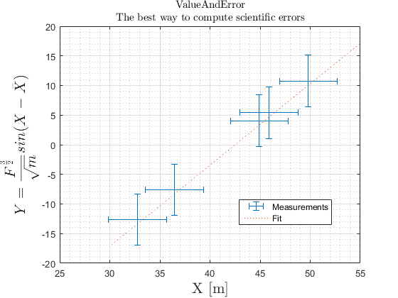

# ValueAndError
 A MATLAB® Object to Manage and Auto-Calculate the Cumulative Scientific-Error of measurements and calculations.




For the all the ways you can benefit from this code, see the example code "ValueAndError_Example".


Get it from MATLAB File Exchange here: 

[](https://www.mathworks.com/matlabcentral/fileexchange/81948-valueanderror)
 ---

## Creating an Instance of ValueAndError:
There's a couple of ways of creating an instance of a ValueAndError object:
1. Standard Construct
   `
   X = ValueAndError( Value , Error )
   `
   * Single Value - Single Error: 
  
        call
        ```MATLAB
        a = ValueAndError( 3.1415 , 0.0001)
        ```
        For a measurement of `a` with value `3.1415` and error estimation of `0.0001`.
        
   * Multiple Values - Single Error:

        call
        ```MATLAB
        b = ValueAndError( [82 , 79 , 90 ] , 5)
        ```
        For 3 measurements of `b` with values given as a vector. The error estimation is the same. ValueAndError will apply the same error for all mesurements.

    * Multiple Values - Multiple Errors:

        call
        ```MATLAB
        c = ValueAndError( [ 0.41 , 0.420 , 0.405 ] , [0.03 , 0.015 , 0.001 ] )
        ```
        For 3 measurements of `c` with values are given as a vector. Each measurement as a different associated error.

2. Value and Cumulative Error From a Function of values and erors ` X = ValueAndError.fromFunction( FunctionHandle_Or_SymbolicFunction , a1,...,aN )`


   When your variable is a result of a calculation involving other values  which are also known only up to some error, its error is derived from the   other variables and the function. This method of creating an instance of  ValueAndError will automatically compute the value and the comulative error.

   * With a Symbolic Function

      search "MATLAB Create Symbolic Functions" for more information about symbolic functions.

      Symbolic Functions are not the easiest way of using ValueAndError, but they hold against some of the problems that Function-Handles face. The most important is, that you can use variables and functions which are only known within the context of your script.

      Example:
      ```MATLAB
      E = ValueAndError.fromFunction( @(m,c) m*c^2 , m , c )
      ```

      


-------
## MIT License

Copyright (c) 2020 Nir Gutman

Permission is hereby granted, free of charge, to any person obtaining a copy
of this software and associated documentation files (the "Software"), to deal
in the Software without restriction, including without limitation the rights
to use, copy, modify, merge, publish, distribute, sublicense, and/or sell
copies of the Software, and to permit persons to whom the Software is
furnished to do so, subject to the following conditions:

The above copyright notice and this permission notice shall be included in all
copies or substantial portions of the Software.

THE SOFTWARE IS PROVIDED "AS IS", WITHOUT WARRANTY OF ANY KIND, EXPRESS OR
IMPLIED, INCLUDING BUT NOT LIMITED TO THE WARRANTIES OF MERCHANTABILITY,
FITNESS FOR A PARTICULAR PURPOSE AND NONINFRINGEMENT. IN NO EVENT SHALL THE
AUTHORS OR COPYRIGHT HOLDERS BE LIABLE FOR ANY CLAIM, DAMAGES OR OTHER
LIABILITY, WHETHER IN AN ACTION OF CONTRACT, TORT OR OTHERWISE, ARISING FROM,
OUT OF OR IN CONNECTION WITH THE SOFTWARE OR THE USE OR OTHER DEALINGS IN THE
SOFTWARE.
